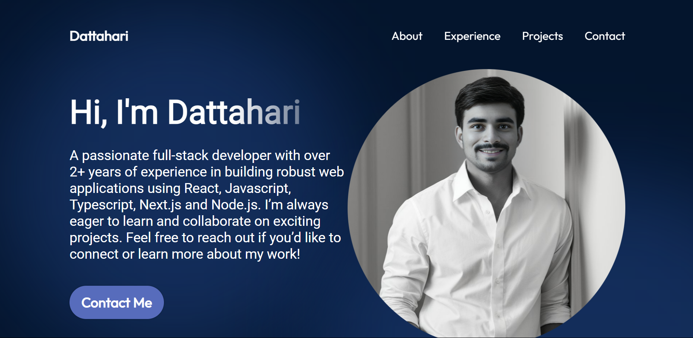

# Portfolio Website

A personal portfolio website built using React.js to showcase my projects, skills, and professional experience. The website features a clean, responsive design, highlighting my work as a Software Engineer with a focus on web development.

## Features

- **Responsive Design:** Optimized for viewing on all devices, including desktops, tablets, and mobile phones.
- **Projects Showcase:** Display of selected projects with descriptions, technologies used, and live demo links.
- **Skills Overview:** Highlights of technical skills, programming languages, and frameworks.
- **About Me:** Section with a brief introduction, background, and career goals.
- **Contact Form:** Integrated contact form for easy communication.

## Tech Stack

- **Frontend:** React.js, HTML, CSS, JavaScript
- **Styling:** CSS
- **Deployment:** Netlify

## Installation

1. Clone the repository:
   ```bash
   git clone https://github.com/dattahari7/portfolio.git
   cd portfolio
